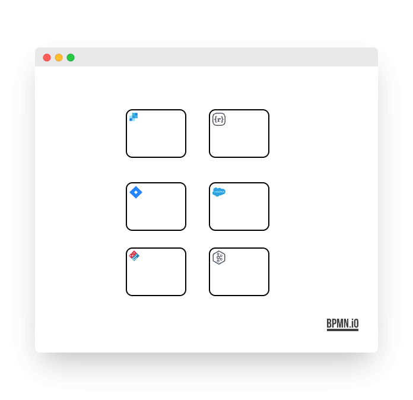

# @bpmn-io/element-templates-icons-renderer

[](https://github.com/bpmn-io/element-templates-icons-renderer/actions/workflows/CI.yml)

A [bpmn-js](https://github.com/bpmn-io/bpmn-js) extension to render [element templates](https://docs.camunda.io/docs/components/modeler/desktop-modeler/element-templates/about-templates/) icons.



## Use Extension

Install via npm:

```
npm install @bpmn-io/element-templates-icons-renderer
```

Use in your [bpmn-js powered editor](https://github.com/bpmn-io/bpmn-js):

```javascript
import ElementTemplatesIconsRenderer from '@bpmn-io/element-templates-icons-renderer';

const viewer = new BpmnViewer({
  additionalModules: [
    ...,
    ElementTemplatesIconsRenderer
  ]
});
```

In case you want to model with the element template icons, make sure you include the underlying [`zeebe-bpmn-moddle`](https://github.com/camunda-cloud/zeebe-bpmn-moddle) descriptors.

```js
import zeebeModdle from 'zeebe-bpmn-moddle/resources/zeebe.json';

const modeler = new BpmnModeler({
  additionalModules: [
    ...,
    ElementTemplatesIconsRenderer
  ],
  moddleExtensions: {
    zeebe: zeebeModdle
  }
});
```
## Run locally

To run the renderer example, execute:

```
npm start
```

## Resources

* [Issues](https://github.com/bpmn-io/element-templates-icons-renderer/issues)
* [Changelog](./CHANGELOG.md)


